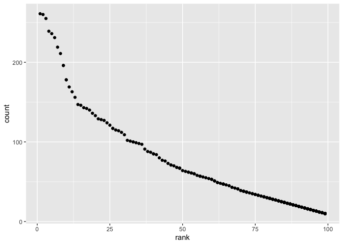

p8105\_hw2\_lcc2181
================

## Problem 1

Loading the packages needed for Problem 1.

``` r
library(tidyverse)
library(readxl)
```

Reading and cleaning the Mr. Trash Wheel sheet. This includes improving
variable names, removing rows that do not have dumpster-specific data,
and rounding the number of sports balls to the nearest integer.

``` r
trash_wheel_df = 
  read_excel("data/Trash-Wheel-Collection-Totals-7-2020-2.xlsx", 
    sheet = "Mr. Trash Wheel", 
    range = "A2:N408") %>%
  janitor::clean_names() %>% 
  drop_na(dumpster) %>% 
  mutate(sports_balls = round(sports_balls, digits = 0))
```

Reading and cleaning precipitation data for 2018. This includes omitting
rows that do not have precipitation data for a specific month and adding
a variable to indicate the year associated with the data.

``` r
precip_2018_df = 
  read_excel ("data/Trash-Wheel-Collection-Totals-7-2020-2.xlsx",
    sheet = "2018 Precipitation",
    range = "A2:B15") %>% 
  janitor::clean_names() %>% 
  drop_na(total, month) %>% 
  mutate(year = 2018)
```

Reading and cleaning precipitation data for 2019. This includes omitting
rows that do not have precipitation data for a specific month and adding
a variable to indicate the year associated with the data.

``` r
precip_2019_df = 
  read_excel ("data/Trash-Wheel-Collection-Totals-7-2020-2.xlsx",
    sheet = "2019 Precipitation",
    range = "A2:B15") %>% 
  janitor::clean_names() %>% 
  drop_na(total, month) %>% 
  mutate(year = 2019)
```

Combining precipitation data sets using a full join to include all
precipitation data for 2018 and 2019. Months are converted from a
numeric to character variable listing the full name of each month.

``` r
precipitation_df = 
  full_join(precip_2018_df, precip_2019_df) %>%
  mutate(month = month.name[as.numeric(month)])
```

    ## Joining, by = c("month", "total", "year")

The number of observations in the cleaned Mr. Trash Wheel data is 345.
There are 14 variables in the cleaned Mr. Trash Wheel data. Examples of
key variables in the cleaned Mr. Trash Wheel data are dumpster, month,
year, date, and homes\_powered. The median number of sports balls in a
dumpster in 2019 was 9. The number of observations in the combined
precipitation data set is 24. There are 3 variables in the combined
precipitation data set, which are month, total, year. The total
precipitation in the year 2018 was 70.33.

## Problem 2

Cleaning data in pols-months.csv. Separating variable mon into three
integer variables – year, month, and day. Months are converted into
character variable containing month name. Since presidents are either
gop or dem, the president variable is created based on the data from the
prez\_dem column, assuming that if the president is not democratic, the
president is republican. Finally, the prez\_gop and prez\_dem varaibles,
as well as the day variable, are removed.

``` r
pols_month_df =
  read_csv("data/pols-month.csv", col_types = "cdddddddd") %>% 
  separate(mon, into= c("year","month","day"), sep= "-", convert = TRUE) %>% 
  mutate(
    month = month.name[as.numeric(month)],
    president = recode(prez_dem, `1`= "dem", `0`= "gop" )
  ) %>% 
  select(-prez_gop, -prez_dem, -day)
```

Cleaning data in snp.csv. Dates are converted to a format with a four
digit year, and then separated into three integer variables – year,
month, and day. Months are converted into character variable containing
month name. Year and month are organized to be the two leading columns,
and day is removed.

``` r
snp_df =
  read_csv("data/snp.csv", col_types = "cd") %>% 
  mutate(date = lubridate::mdy(date)) %>% 
  separate(date, into = c("year","month","day"), sep = "-", convert = TRUE) %>% 
  mutate(month = month.name[as.numeric(month)]) %>% 
  relocate(year,month) %>% 
  select(-day)
```

Tidying data in unemployment.csv. Using pivot\_longer to switch from
wide to long format. Months are re-coded from abbreviated to full to
ensure consistency with the other data sets. Names are cleaned to ensure
variable names are lowercase to be consistent with other the data sets.

``` r
unemployment_df =
  read_csv("data/unemployment.csv", col_types = "idddddddddddd") %>% 
  pivot_longer(Jan:Dec,
      names_to = "month",
      values_to = "unemployment"
  ) %>% 
  mutate(month = recode(month, 
        "Jan" = "January", "Feb" = "February", "Mar" = "March", "Apr"=    
        "April", "May" = "May", "Jun" = "June", "Jul" = "July", "Aug" =  
        "August", "Sep" =  "September", "Oct" = "October", "Nov" = 
        "November", "Dec" = "December")) %>% 
  janitor::clean_names()
```

Joining data sets by merging snp\_df into pols\_month\_df, and then
merging unemployment into result.

``` r
pols_snp_df = 
  left_join(pols_month_df, snp_df, by = c("year", "month"))

fivethirtyeight_df =
  left_join(pols_snp_df, unemployment_df, by = c("year","month"))
```

The pols-month data contained information about the number of republican
and democratic governors, senators, and representatives on the
associated date as well as whether the president was republican and
democratic. The snp data contained information about the closing values
of the S&P stock index on the date associated. The unemployment data
contained measurements of the percentage of unemployment by month and
year. The resulting merged data set has 822 rows and 11 columns. It
ranges from the years 1947 to 2015. The key variables in the resulting
data set include year, month, president, close, and unemployment.

## Problem 3

Loading and tidying data from Popular\_Baby\_Names.csv

``` r
baby_names_df =
  read_csv("data/Popular_Baby_Names.csv") %>% 
  janitor::clean_names() %>% 
  mutate(
    ethnicity = recode(ethnicity, 
    "BLACK NON HISP" = "BLACK NON HISPANIC", 
    "WHITE NON HISP" = "WHITE NON HISPANIC", 
    "ASIAN AND PACI" = "ASIAN AND PACIFIC ISLANDER")
  ) %>% 
  mutate(
    childs_first_name = str_to_title(childs_first_name)
  ) %>% 
  distinct()
```

    ## Rows: 19418 Columns: 6

    ## ── Column specification ────────────────────────────────────────────────────────
    ## Delimiter: ","
    ## chr (3): Gender, Ethnicity, Child's First Name
    ## dbl (3): Year of Birth, Count, Rank

    ## 
    ## ℹ Use `spec()` to retrieve the full column specification for this data.
    ## ℹ Specify the column types or set `show_col_types = FALSE` to quiet this message.

Table showing rank in popularity of name “Olivia” as female baby name
over time

``` r
filter(baby_names_df, gender == "FEMALE", childs_first_name == "Olivia") %>%
  pivot_wider(
   id_cols = c("ethnicity"),
   names_from = "year_of_birth",
   values_from = "rank"
   ) %>% 
  knitr::kable()
```

| ethnicity                  | 2016 | 2015 | 2014 | 2013 | 2012 | 2011 |
|:---------------------------|-----:|-----:|-----:|-----:|-----:|-----:|
| ASIAN AND PACIFIC ISLANDER |    1 |    1 |    1 |    3 |    3 |    4 |
| BLACK NON HISPANIC         |    8 |    4 |    8 |    6 |    8 |   10 |
| HISPANIC                   |   13 |   16 |   16 |   22 |   22 |   18 |
| WHITE NON HISPANIC         |    1 |    1 |    1 |    1 |    4 |    2 |

Table showing most popular name among male children over time

``` r
filter(baby_names_df, gender == "MALE", rank == 1) %>% 
  pivot_wider(
    id_cols = c("ethnicity"),
    names_from = "year_of_birth",
    values_from = "childs_first_name"
    ) %>% 
  knitr::kable()
```

| ethnicity                  | 2016   | 2015   | 2014   | 2013   | 2012   | 2011    |
|:---------------------------|:-------|:-------|:-------|:-------|:-------|:--------|
| ASIAN AND PACIFIC ISLANDER | Ethan  | Jayden | Jayden | Jayden | Ryan   | Ethan   |
| BLACK NON HISPANIC         | Noah   | Noah   | Ethan  | Ethan  | Jayden | Jayden  |
| HISPANIC                   | Liam   | Liam   | Liam   | Jayden | Jayden | Jayden  |
| WHITE NON HISPANIC         | Joseph | David  | Joseph | David  | Joseph | Michael |

Scatter plot showing number of children with name against rank in
popularity of that name among male, white non-hispanic children born in
2016

``` r
filter(baby_names_df, gender == "MALE", ethnicity == "WHITE NON HISPANIC", year_of_birth == 2016)%>% 
ggplot(aes(x = rank, y = count)) + geom_point()
```

<!-- -->
